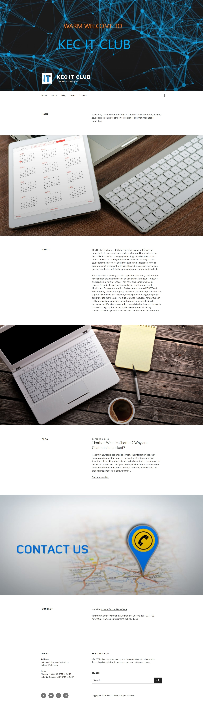
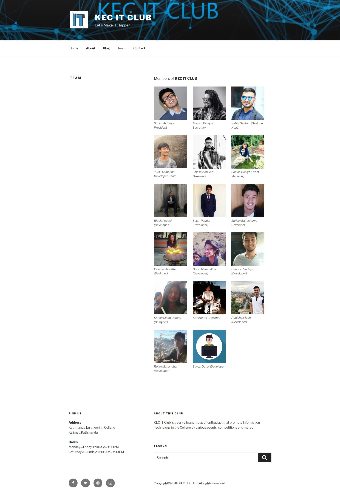

# Wordpress-site
KEC IT CLUB website is made using WordPress(for Practice)
## Screenshot

## Development
Used WordPress 4.9.8-en_GB for developing the site on windows 10

### Theme
- **Twenty Seventeen** *version 1.7*
### Plugins
- **All-in-One WP Migration** *Version 6.67* for import/export of site to local computer
- **Autoptimize** *Version 2.4*  for Optimize website's performance: JS, CSS, HTML, images, Google Fonts and more.
- **Imagify** *Version 1.8.2* to reduce image file sizes without losing quality, to make  website load faster.

### Extra
- Learned Wordpress from this [Vedio](https://www.youtube.com/watch?v=2cbvZf1jIJM&t=1811s) of tyler moore.
- Used [UltimateFreeHost](http://www.ultimatefreehost.in/) to host the site

## License
This project is licensed under the MIT License - see the [LICENSE](LICENSE) file for detail.
